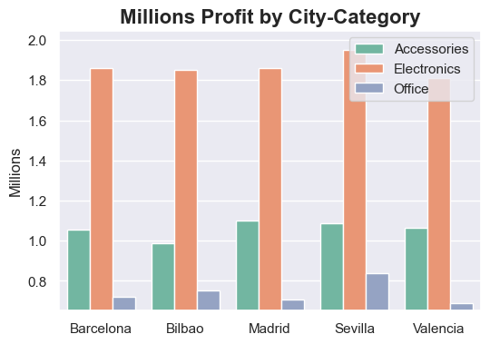
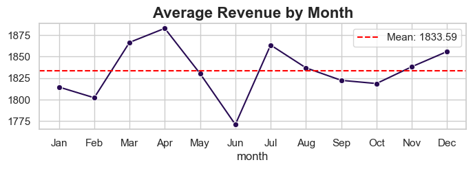

# 🛒 E-commerce Sales Data Pipeline & Analysis

## 📌 Project Overview
This project demonstrates a professional end-to-end data engineering and analysis pipeline. Using a dataset of 10,000 retail records, it automates the process of extracting raw data, cleaning inconsistencies, and generating business-critical insights. 

## 📊 Visual examples of the analysis results

*Click the images to explore the full interactive analysis in the Jupyter Notebook.*

## 🛠️ Tech Stack
- **Language:** Python 3.11
- **Primary Library:** Pandas (Advanced Data Wrangling)
- **Numerical Logic:** NumPy (Vectorized Operations)
- **Visualization:** Seaborn & Matplotlib
- **Environment:** Jupyter Notebooks / VS Code

## ⚡ Key Engineering Features
- **Median Imputation:** Automated handling of missing `unit_price` values by grouping by product type to ensure statistical accuracy.
- **Categorical Normalization:** Cleaned inconsistent naming conventions using vectorized string operations.
- **Feature Engineering:** Creation of performance KPIs like `total_revenue` and time-based metrics.
- **Outlier Detection:** Statistical analysis to identify anomalies in sales quantities and prices.

## 📊 Business Insights
- **Sales Seasonality:** Revenue peaks during the second quarter (April and May), with earnings exceeding €1.6M. Conversely, February is identified as the month with the lowest commercial activity, suggesting an opportunity for pre-emptive marketing campaigns.
- **Weekly Sales Trends:** There is a stronger purchasing trend during weekends, with Saturday having the highest average revenue per transaction. Mondays show the lowest sales volume of the week.
- **Product Performance Ranking:** Keyboards and Smartphones lead revenue generation, totaling over €7.6M combined. Keyboards slightly outperform smartphones in total sales volume.
- **Revenue Distribution by City:** Seville stands as the most profitable market with €3.87M in total sales, outperforming major hubs like Madrid and Barcelona.
- **Category Dominance:** The Electronics sector is the primary business driver, accounting for over 50% of total revenue (€9.33M), followed by Accessories and Office products.
- **Customer Segmentation:** There is a clear predominance of Gmail users, who account for more than 50% of total orders, which simplifies targeted segmentation for future email marketing campaigns.

## 📈 Key Results (2025 Analysis)
After processing 10,000 records, the pipeline yielded the following insights:
- **Total Revenue:** $18,339,362.04
- **Average Order Value (AOV):** $1,833.94
- **Top Segment:** The type of customer 'User' segment represents the highest revenue share.
- **Regional Insight:** Identified a significant market gap in the 'Office' category within the Seville region.

## 🚀 How to Run
1. Clone the repository.
2. Install dependencies: `pip install -r requirements.txt`.
3. Open `notebooks/E-commerce_Data_Analysis.ipynb` and run all cells.
